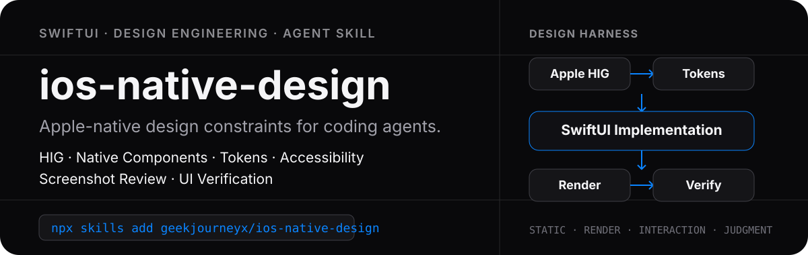

<p align="center">
  
</p>

<p align="center">
  <a href="https://skills.sh/geekjourneyx/ios-native-design"></a>
</p>

<p align="center">
  <strong>Stop asking coding agents to “make it look more Apple”. Make them operate the app and prove it.</strong>
</p>

`ios-native-design` is a reusable iOS design-engineering Skill for AI coding agents. It turns Apple HIG, native component choices, semantic tokens, accessibility, **agent-operated runtime testing**, Device Hub screenshots, and deterministic UI regression into one repeatable workflow.

## Install

```bash
npx skills add geekjourneyx/ios-native-design
```

Explicit selection:

```bash
npx skills add geekjourneyx/ios-native-design --skill ios-native-design
```

Global install:

```bash
npx skills add geekjourneyx/ios-native-design -g
```

## The key idea

A SwiftUI screen is not finished because it compiles. It is not finished because Preview looks good. It is not even finished because an agent looked at one screenshot.

The highest-value verifier is the **running app**.

```text
Requirement
    ↓
HIG + native components + tokens
    ↓
SwiftUI implementation
    ↓
Build + launch
    ↓
Agent operates the app
tap · swipe · scroll · type
    ↓
Device Hub evidence
screenshot · accessibility semantics · environment
    ↓
Visual + behavioral review
    ↓
Fix and rerun
    ↓
Stable critical path
    ↓
XCUI regression
```

With Xcode 27, this is increasingly a native agent workflow: agents can drive a running app, while Device Hub unifies simulated and physical devices and can capture full-resolution device screenshots.

## Verification priority

| Priority | Layer | Purpose |
|---|---|---|
| **P0** | Agent runtime exploration | Prove the actual task works in the rendered app |
| **P0** | Device Hub + accessibility evidence | See what the user sees and what assistive tech sees |
| **P1** | XCUI + physical-device smoke | Turn stable flows into repeatable regression |
| **P1** | Preview matrix | Fast component/state iteration |
| **P2** | Static verifier + snapshots | Prevent design-system drift |

This is intentionally different from a static style guide.

> Static lint can tell you `.padding(17)` exists. It cannot tell you whether the screen is actually good.

## Runtime capability routing

Use the highest-level reliable runtime interface available:

```text
Xcode native agent tools?
  → use them

Semantic iOS simulator automation?
  → use it

Computer Use?
  → drive Xcode + Device Hub

No runtime automation?
  → CLI + Preview + manual screenshots
```

The rule is simple:

> **CLI/semantic tools for deterministic work. Computer Use for visual and GUI-only work.**

Avoid raw coordinate clicking when a semantic target exists.

## Device Hub as visual evidence

For final visual review, prefer Device Hub's own Screenshot control over a screenshot of the Mac desktop.

Apple documents that Device Hub captures at the **full resolution of the simulated or physical device regardless of Mac display resolution** and saves the image to the Mac Desktop.

That creates a very efficient loop:

```text
Agent navigates app
    ↓
Device Hub Screenshot
    ↓
Agent reads full-resolution file
    ↓
compare / critique
    ↓
fix
    ↓
repeat
```

Use desktop/Computer Use screenshots for navigation context. Use Device Hub captures as final visual evidence when available.

## Explore → codify

Do not make an LLM rediscover a stable critical path forever.

```text
Agent exploration
  → discovers bug / reliable path
  → fixes and reruns
  → stable flow
  → XCUI test
  → deterministic CI
```

This keeps agent testing high-value: agents search for unknown problems; deterministic tests guard known behavior.

## What is inside

```text
skills/ios-native-design/
├── SKILL.md
├── DESIGN_DOD.md
├── VERIFIER_RULES.md
├── references/
│   ├── apple-hig-baseline.md
│   ├── native-components.md
│   ├── design-tokens.md
│   ├── layout-spacing.md
│   ├── typography-color.md
│   ├── motion-materials.md
│   ├── accessibility.md
│   ├── agent-device-testing.md
│   ├── device-hub.md
│   ├── computer-use-testing.md
│   ├── testing.md
│   └── visual-review.md
├── templates/
│   ├── DesignTokens.swift
│   ├── AGENT_UI_TEST_PROMPT.md
│   ├── DEVICE_TEST_MATRIX.md
│   └── SCREENSHOT_REVIEW_PROMPT.md
├── tests/
│   └── test_skill_contract.py
└── verifier/
    ├── ios_design_verifier.py
    ├── verifier.config.json
    └── README.md
```

## Design rules are still layered

| Rule class | Evidence |
|---|---|
| **STATIC** | source code |
| **RENDER** | device-resolution screenshots |
| **INTERACTION** | running behavior + semantics/accessibility |
| **JUDGMENT** | product/design reasoning across runtime evidence |

The static verifier remains deliberately narrow. It catches raw colors, fixed font sizes, magic spacing/radii, likely native-control recreation, and similar drift.

```bash
python3 skills/ios-native-design/verifier/ios_design_verifier.py /path/to/ios-project
```

But it is **P2**, not the core proof of design quality.

## Use it with an agent

After installation:

```text
Use ios-native-design to implement and verify this SwiftUI flow.

After coding:
1. build and launch the app;
2. operate the affected flow yourself;
3. use Device Hub / simulator tools to tap, swipe, scroll, and type;
4. capture device-resolution screenshots at major checkpoints;
5. inspect accessibility semantics when available;
6. run the applicable device/environment matrix;
7. fix Blocker and Major findings and rerun;
8. encode the stable critical path as XCUI regression.
```

For a review-only pass:

```text
Use ios-native-design to audit this running iOS flow.
Do not review source only. Exercise the app, collect runtime evidence,
then report Runtime coverage / Blocker / Major / Minor / Regression.
```

## Design philosophy

1. **Apple-native, not Apple-looking.** Platform behavior matters more than decorative resemblance.
2. **Runtime truth beats source confidence.** Operate the app before declaring UI work complete.
3. **Native component first.** Custom controls need a product reason.
4. **Semantic over arbitrary.** Prefer Dynamic Type, system colors, SF Symbols, and meaningful tokens.
5. **Accessibility is design quality.** Screenshot + accessibility semantics are stronger together.
6. **Explore with agents, regress with tests.** Unknown problems deserve exploration; known paths deserve XCUI.
7. **Automate what is objective.** Static checks are guardrails, not aesthetic judges.
8. **Physical device when hardware matters.** Simulator success is not proof of device-only behavior.

## Primary references

- [Apple Human Interface Guidelines](https://developer.apple.com/design/human-interface-guidelines/)
- [Apple Design Resources](https://developer.apple.com/design/resources/)
- [Apple Device Hub](https://developer.apple.com/documentation/xcode/device-hub/)
- [Capture screenshots and videos](https://developer.apple.com/documentation/xcode/capturing-screenshots-and-videos-from-devices)
- [WWDC26 — Get the most out of Device Hub](https://developer.apple.com/videos/play/wwdc2026/260/)
- [WWDC26 — Platforms State of the Union](https://developer.apple.com/videos/play/wwdc2026/102/)
- [ZCode iOS simulator plugin](https://www.zcode.network/en/docs/plugin/)
- [skills CLI](https://www.skills.sh/docs/cli)

---

<p align="center"><sub>Design engineering infrastructure for agent-operated iOS development.</sub></p>
